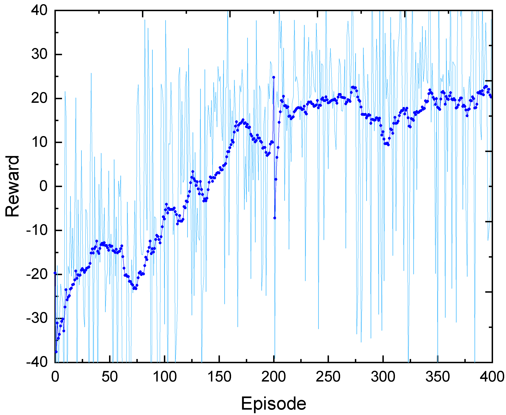

# uav-navigation

 This repository implements a UAV obstacle avoidance task from monocular vision using Reinforcement Learning algorithm in Airsim Simulator. The algorithm we are using is Proximal Policy Optimization (PPO). The RGB images from the front camera is converted into depthmap using Depth-Anything algorithm. The estimated depthmap is then mapped into three discrete action. 

[Watch Demo on YouTube](https://youtu.be/AIPO_2PU6kA?si=6YHjZODv4oCTHGEx)

## Observation Space
<li> Depthmap </li>
<li> Relative Heading Angle </li>

## Action Space
<table border="1" cellspacing="0" cellpadding="10">
        <thead>
            <tr>
                <th>No</th>
                <th>Name</th>
                <th>Action</th>
            </tr>
        </thead>
        <tbody>
            <tr>
                <td>0</td>
                <td>Forward</td>
                <td>Move straight (1s)
            </tr>
            <tr>
                <td>1</td>
                <td>Left</td>
                <td>Yaw left 25 deg/s </td>
            </tr>
            <tr>
                <td>2</td>
                <td>Right </td>
                <td>Yaw right 25 deg/s</td>
            </tr>
        </tbody>
    </table>

<!-- ## Navigation Example -->
<!--  -->

## Reward / Episode Graphs -->

